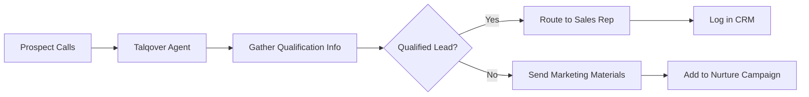

# Integration Examples

Talqover integrates seamlessly with your existing business systems to create powerful automated workflows. This guide provides practical examples of how companies use Talqover to enhance their customer service, sales, and operational processes.

## Overview

Talqover provides a client-side AI voice agent that can talk naturally and has access to tools (actions) that you configure. The AI agent handles the conversation while your client-side application manages the business logic and integrations.

## How It Works

1. **AI Agent**: Handles natural conversation with callers
2. **Tools/Actions**: Available to the AI during conversations
3. **Client-Side Logic**: Your application processes the actions and manages integrations
4. **Business Systems**: Your existing systems handle the actual operations

## Available Action Types

Talqover provides seven types of actions that the AI agent can use during conversations:

### 1. **End Conversation** (`end_conversation`)
The AI agent ends the call gracefully with a farewell message.

### 2. **DTMF** (`dtmf`)
The AI agent collects touch-tone input from the caller (e.g., "Press 1 for sales, 2 for support").

### 3. **Transfer Call** (`transfer_call`)
The AI agent transfers the call to a specific phone number or extension.

### 4. **Capture Data** (`capture_data`)
The AI agent sends conversation data to your client-side application for processing.

### 5. **Set on Hold** (`set_on_hold`)
The AI agent places the caller on hold for a specified duration.

### 6. **External Knowledge** (`external`)
The AI agent makes requests to your client-side application to retrieve or process information.

### 7. **Add to Conference** (`add_to_conference`)
*Currently commented out in the interface - the AI agent adds caller to a conference call.

## Action Configuration

Each action can be configured with:

- **Name**: Human-readable action name (letters and spaces only)
- **Description**: When/how the AI agent should use this action
- **Type**: One of the seven action types above
- **URL**: For external and capture_data actions - your client-side endpoint
- **Authorization URL**: Optional authentication endpoint for your application
- **Inputs**: For external and capture_data actions - parameters the AI will send
- **Transfer To**: For transfer_call actions - destination phone number
- **Hold Duration**: For set_on_hold actions - duration in seconds

## Input Types

Actions can accept these input types:
- **String**: Text data (names, descriptions, etc.)
- **Number**: Numeric values (quantities, durations, etc.)
- **Boolean**: True/false values (flags, toggles, etc.)

## Client-Side Integration

Your client-side application handles the actual business logic:

- **Process action requests** from the AI agent
- **Connect to your business systems** (CRM, databases, APIs)
- **Execute operations** based on AI agent requests
- **Return results** to the AI agent for conversation continuation
- **Manage data flow** between the AI agent and your systems

## Action Type Examples

### End Conversation Action
```
Action Name: "Thank Customer and End"
Type: end_conversation
Description: "End the call with a polite thank you message after resolving the customer's issue"

Use Case: After successfully resolving a customer inquiry, end the call professionally.
```

### DTMF Action
```
Action Name: "Menu Selection"
Type: dtmf
Description: "Collect customer's menu choice for routing to appropriate department"

Use Case: "Press 1 for sales, 2 for support, 3 for billing" - collect the customer's choice.
```

### Transfer Call Action
```
Action Name: "Transfer to Sales Team"
Type: transfer_call
Transfer To: "+1-555-0123"
Description: "Transfer call to sales team when customer shows purchase intent"

Use Case: When a customer wants to discuss pricing or make a purchase.
```

### Capture Data Action
```
Action Name: "Log Customer Feedback"
Type: capture_data
URL: https://your-app.com/api/feedback/log
Inputs: 
  - customer_id (string, required)
  - feedback_rating (number, required) 
  - feedback_text (string)
Description: "AI agent captures customer feedback and sends to your application"

Use Case: After resolving an issue, the AI agent collects customer satisfaction feedback and sends it to your client-side application for processing.
```

### Set on Hold Action
```
Action Name: "Hold for Processing"
Type: set_on_hold
Hold Duration: "30"
Description: "AI agent places customer on hold while processing their request"

Use Case: When the AI agent needs time to process a complex request or wait for your application to complete an operation.
```

### External Knowledge Action
```
Action Name: "Check Inventory"
Type: external
URL: https://your-app.com/api/inventory/check
Inputs:
  - product_id (string, required)
  - location (string)
Description: "AI agent requests inventory information from your application"

Use Case: When a customer asks about product availability, the AI agent requests this information from your client-side application, which then queries your inventory system.
```

## Customer Service Integrations

### CRM Integration with AI Agent Actions

Configure actions that allow your AI agent to interact with your CRM system through your client-side application.

#### Use Case: E-commerce Support

**Scenario**: An online retailer wants their AI agent to look up customer information, log interactions, and create support tickets during calls.

**Client-Side Setup**:

Your application provides these endpoints for the AI agent to use:

```
Endpoint 1: "Lookup Customer" (External Knowledge)
- Type: external
- URL: https://your-app.com/api/customers/lookup
- Inputs: phone_number (string, required), email_address (string)
- Your App: Queries your CRM database and returns customer information

Endpoint 2: "Log Interaction" (Capture Data)
- Type: capture_data  
- URL: https://your-app.com/api/interactions/log
- Inputs: customer_id (string, required), conversation_summary (string, required)
- Your App: Creates interaction record in your CRM system

Endpoint 3: "Create Support Ticket" (External Knowledge)
- Type: external
- URL: https://your-app.com/api/tickets/create
- Inputs: customer_id (string, required), issue_type (string, required), priority (string)
- Your App: Creates support ticket in your CRM and assigns to team
```

**Client-Side Flow**:

```
Step 1: Customer provides contact info
↓
AI Agent: "Let me look up your information"
  → POST to https://your-app.com/api/customers/lookup
  → Your App: Queries CRM database
  → Your App: Returns customer data to AI agent
↓
Step 2: AI Agent handles inquiry
↓
AI Agent: "I'll log this interaction"
  → POST to https://your-app.com/api/interactions/log
  → Your App: Creates record in CRM system
↓
Step 3: If issue requires escalation
↓
AI Agent: "Let me create a support ticket"
  → POST to https://your-app.com/api/tickets/create
  → Your App: Creates ticket in CRM and assigns to team
```

**Real-time Conversation Example**:

```
Customer: "Hi, I need help with my order #12345"

AI Agent: "I'd be happy to help! Let me look up your order information."
[AI Agent uses: Lookup Customer action (external)]
  → POST to your app: https://your-app.com/api/customers/lookup
  → Your app queries CRM database
  → Your app returns customer data to AI agent

AI Agent: "I found your order. It was shipped yesterday and should arrive 
by Friday. I can see you've been a customer for 2 years - thank you 
for your loyalty!"
[AI Agent uses: Log Interaction action (capture_data)]
  → POST to your app: https://your-app.com/api/interactions/log
  → Your app creates record in CRM system

Customer: "Actually, I need to change the delivery address"

AI Agent: "I can help with that! Let me update your delivery address 
and send you a confirmation."
[AI Agent uses: Update Order action (external)]
[AI Agent uses: Log Interaction action (capture_data)]
```

**Benefits**:
- Complete customer interaction history
- Automatic ticket creation for complex issues
- Improved support team efficiency
- Better customer service metrics tracking

### Knowledge Base Integration

Connect your agent to your existing knowledge base for accurate answers.

#### Use Case: SaaS Product Support

**Scenario**: A software company wants their voice agent to answer questions using their documentation and FAQ.

**Integration Setup**:

```javascript
// Search knowledge base for relevant articles
const searchResults = await knowledgeBase.search({
  query: customerQuestion,
  categories: ['billing', 'technical', 'account'],
  maxResults: 3
});

// Generate response using found articles
const response = await generateResponse({
  question: customerQuestion,
  context: searchResults,
  tone: 'helpful and technical'
});
```

**Sample Interaction**:

```
Customer: "How do I reset my password?"

Agent: "I can help you reset your password! There are two ways 
to do this. You can click 'Forgot Password' on the login page 
and we'll send a reset link to your email, or I can send you 
a temporary password right now. Which would you prefer?"
```

## Appointment-Based Business Integrations

### Scheduling System Integration with AI Agent Actions

Configure actions that allow your AI agent to interact with your scheduling system through your client-side application.

#### Use Case: Medical Practice

**Scenario**: A dental office wants their AI agent to check availability, book appointments, and send confirmations during calls.

**Client-Side Setup**:

Your application provides these endpoints for the AI agent to use:

```
Endpoint 1: "Check Availability" (External Knowledge)
- Type: external
- URL: https://your-app.com/api/scheduling/availability/check
- Inputs: service_type (string, required), date_range (string, required), provider_id (string)
- Your App: Queries your scheduling system for available slots

Endpoint 2: "Book Appointment" (External Knowledge)
- Type: external
- URL: https://your-app.com/api/scheduling/appointments/book
- Inputs: patient_id (string, required), service_type (string, required), datetime (string, required), duration (number, required)
- Your App: Creates appointment in your scheduling system

Endpoint 3: "Send Confirmation" (Capture Data)
- Type: capture_data
- URL: https://your-app.com/api/notifications/confirmations/send
- Inputs: appointment_id (string, required), patient_contact_info (string, required)
- Your App: Sends confirmation notifications via email/SMS

Endpoint 4: "Reschedule Appointment" (External Knowledge)
- Type: external
- URL: https://your-app.com/api/scheduling/appointments/reschedule
- Inputs: appointment_id (string, required), new_datetime (string, required)
- Your App: Updates existing appointment in your scheduling system
```

**Client-Side Flow**:

```
Step 1: Customer requests appointment
↓
AI Agent: "Let me check our available appointments"
  → POST to https://your-app.com/api/scheduling/availability/check
  → Your App: Queries scheduling system for available slots
  → Your App: Returns available times to AI agent
↓
Step 2: Customer selects time
↓
AI Agent: "Perfect! Let me book that appointment"
  → POST to https://your-app.com/api/scheduling/appointments/book
  → Your App: Creates appointment in scheduling system
  → Your App: Returns confirmation details to AI agent
↓
Step 3: Confirm booking
↓
AI Agent: "I'll send you a confirmation"
  → POST to https://your-app.com/api/notifications/confirmations/send
  → Your App: Sends email and SMS confirmations
```

**Real-time Conversation Example**:

```
Patient: "I need to schedule a dental cleaning"

AI Agent: "I'd be happy to help you schedule a cleaning! Let me check 
our available appointments."
[AI Agent uses: Check Availability action (external)]
  → POST to your app: https://your-app.com/api/scheduling/availability/check
  → Your app queries scheduling system
  → Your app returns available slots to AI agent

AI Agent: "I have several openings next week. Dr. Smith has availability 
on Tuesday at 2 PM, Wednesday at 10 AM, or Friday at 3 PM. 
Which works best for you?"
[AI Agent uses data from your app's response]

Patient: "Tuesday at 2 PM sounds good"

AI Agent: "Perfect! Let me book that appointment for you."
[AI Agent uses: Book Appointment action (external)]
  → POST to your app: https://your-app.com/api/scheduling/appointments/book
  → Your app creates appointment in scheduling system
  → Your app returns confirmation to AI agent

AI Agent: "Great! I've confirmed your dental cleaning for Tuesday, 
March 15th at 2 PM with Dr. Smith. You'll receive a confirmation 
email and a reminder text the day before."
[AI Agent uses: Send Confirmation action (capture_data)]
  → POST to your app: https://your-app.com/api/notifications/confirmations/send
  → Your app sends email and SMS confirmations
```

**Sample Conversation**:

```
Agent: "I can help you schedule your cleaning appointment. 
Dr. Smith has availability next week on Tuesday at 2 PM, 
Wednesday at 10 AM, or Friday at 3 PM. Which works best?"

Patient: "Tuesday at 2 PM sounds good."

Agent: "Perfect! I've booked your dental cleaning for Tuesday, 
March 15th at 2 PM with Dr. Smith. You'll receive a confirmation 
email and a reminder text the day before. Is there anything 
else I can help with?"
```

### Multi-Location Scheduling

Handle scheduling across multiple business locations.

#### Use Case: Fitness Chain

**Scenario**: A gym chain wants customers to book classes at any location through one phone number.

**Features**:
- Location-based availability
- Class type and instructor preferences
- Membership validation
- Waitlist management

```javascript
// Find nearby locations
const locations = await locationService.findNearby({
  address: customerAddress,
  radius: 10, // miles
  hasService: 'yoga_classes'
});

// Check class availability across locations
const classes = await Promise.all(
  locations.map(location => 
    schedulingSystem.getClasses({
      locationId: location.id,
      date: requestedDate,
      type: 'yoga'
    })
  )
);
```

## Sales Team Integrations

### Lead Qualification and Routing

Qualify prospects before connecting them with sales representatives.

#### Use Case: B2B Software Sales

**Scenario**: A software company wants to qualify inbound sales calls and route qualified leads to appropriate sales reps.

**Qualification Process**:



**Qualification Script**:

```
Agent: "I'd be happy to connect you with our sales team! 
To make sure you speak with the right specialist, can 
you tell me a bit about your company and what type of 
solution you're looking for?"

Qualification Criteria:
• Company size (employee count)
• Industry and use case
• Budget range
• Decision timeline
• Current solutions in use
```

**CRM Integration**:

```javascript
// Create qualified lead in CRM
const lead = await crm.createLead({
  name: prospectName,
  company: companyName,
  phone: phoneNumber,
  email: emailAddress,
  source: 'voice_call',
  qualificationScore: calculateScore(responses),
  notes: conversationSummary,
  assignedTo: getAppropriateRep(responses)
});

// Schedule follow-up call
await crm.createTask({
  leadId: lead.id,
  type: 'sales_call',
  scheduledFor: preferredCallTime,
  description: 'Follow up on qualified voice lead'
});
```

### Product Information and Demos

Provide detailed product information and schedule demos.

#### Use Case: Real Estate

**Scenario**: A real estate agency wants to provide property information and schedule viewings.

**Features**:
- Property search by criteria
- Virtual tour scheduling
- Agent availability checking
- Lead capture and follow-up

```javascript
// Search properties based on criteria
const properties = await mls.searchProperties({
  location: searchArea,
  priceRange: budgetRange,
  bedrooms: bedroomCount,
  propertyType: 'single_family'
});

// Schedule property viewing
const viewing = await calendar.scheduleViewing({
  propertyId: selectedProperty.id,
  agentId: assignedAgent.id,
  prospectInfo: leadData,
  requestedTime: preferredTime
});
```

## Support Process Enhancement

### Ticket Creation and Routing

Automatically create and route support tickets based on call content.

#### Use Case: Technology Company

**Scenario**: A tech company wants to automatically categorize and route support requests.

**Intelligent Routing**:

```javascript
// Analyze call content for issue categorization
const issueCategory = await ai.categorizeIssue({
  transcript: callTranscript,
  categories: [
    'billing', 'technical', 'account', 
    'feature_request', 'bug_report'
  ]
});

// Determine priority level
const priority = assessPriority({
  category: issueCategory,
  customerTier: customer.tier,
  keywords: extractKeywords(callTranscript)
});

// Create and route ticket
const ticket = await ticketingSystem.createTicket({
  customerId: customer.id,
  category: issueCategory,
  priority: priority,
  subject: generateSubject(callSummary),
  description: formatDescription(callTranscript),
  assignedTeam: getTeamForCategory(issueCategory)
});
```

### Status Updates and Notifications

Provide real-time status updates for ongoing issues.

#### Use Case: Service Provider

**Scenario**: An internet service provider wants customers to check service status and report outages.

**Status Check Flow**:

```javascript
// Check service status for customer location
const serviceStatus = await networkMonitoring.checkStatus({
  customerAddress: customer.address,
  accountNumber: customer.accountNumber
});

if (serviceStatus.hasOutage) {
  const response = `I can see there's a service outage in your 
  area affecting ${serviceStatus.affectedCustomers} customers. 
  Our technicians are working on it and expect to have service 
  restored by ${serviceStatus.estimatedRestoration}. I'll send 
  you updates via text message.`;
} else {
  // Proceed with troubleshooting
  const troubleshootingSteps = await getTroubleshootingSteps({
    serviceType: customer.serviceType,
    reportedIssue: customerIssue
  });
}
```

## Advanced Workflow Patterns

### Multi-Action Workflows

Configure complex workflows that execute multiple actions in sequence across different systems.

#### Use Case: E-commerce Order Management

**Scenario**: Handle complex order modifications that require updates across multiple systems using workflow actions.

**Multi-Action Workflow Setup**:

In the Talqover workflow builder, create a sequence of actions:

```
Workflow: "Process Order Change"
Trigger: Customer requests order modification

Action 1: "Validate Order Status"
- Function: Check if order can be modified
- Parameters: order_id, modification_type
- Returns: can_modify, current_status, restrictions

Action 2: "Update Order System"
- Function: Modify order in primary system
- Parameters: order_id, new_details, modification_reason
- Returns: updated_order, confirmation_number

Action 3: "Update Inventory"
- Function: Adjust inventory levels
- Parameters: product_id, quantity_change, location
- Returns: new_inventory_level, backorder_status

Action 4: "Recalculate Shipping"
- Function: Update shipping costs and delivery
- Parameters: order_id, new_address, shipping_method
- Returns: new_shipping_cost, delivery_date

Action 5: "Process Payment Adjustment"
- Function: Handle refunds or additional charges
- Parameters: order_id, amount_change, payment_method
- Returns: payment_status, refund_id

Action 6: "Send Confirmation"
- Function: Notify customer of changes
- Parameters: order_id, customer_email, change_summary
- Returns: confirmation_sent_status
```

**Workflow Builder Configuration**:

```
Step 1: Customer requests order change
↓
Action: "Validate Order Status"
  → Check if order is still modifiable
  → Verify current order status
  → Determine any restrictions
↓
Step 2: If modification allowed
↓
Action: "Update Order System"
  → Modify order in primary system
  → Generate new order confirmation
↓
Action: "Update Inventory"
  → Adjust inventory levels
  → Check for backorder situations
↓
Action: "Recalculate Shipping"
  → Update shipping costs
  → Adjust delivery timeline
↓
Action: "Process Payment Adjustment"
  → Handle refunds or charges
  → Update payment records
↓
Action: "Send Confirmation"
  → Email customer with changes
  → Update order tracking
```

**Real-time Conversation Example**:

```
Customer: "I need to change the delivery address for my order #12345"

Agent: "I'd be happy to help you update your delivery address! 
Let me check if your order can still be modified."
[Executes: Validate Order Status action]

Agent: "Great! Your order is still being processed, so I can 
update the address. Let me make that change for you."
[Executes: Update Order System action]
[Executes: Recalculate Shipping action]

Agent: "Perfect! I've updated your delivery address. The shipping 
cost remains the same, and your new delivery date is Friday 
instead of Thursday. You'll receive an updated confirmation 
email shortly."
[Executes: Send Confirmation action]
```

### Conditional Action Workflows

Create intelligent workflows that execute different actions based on conversation context.

#### Use Case: Customer Support Escalation

**Scenario**: Automatically escalate complex issues while handling simple ones directly.

**Conditional Workflow Setup**:

```
Workflow: "Smart Support Routing"
Trigger: Customer support inquiry

Condition 1: Simple Question
- If: Question type = "information_request"
- Then: Execute "Provide Information" action
- Then: Execute "Log Interaction" action

Condition 2: Technical Issue
- If: Issue type = "technical_problem" AND complexity = "simple"
- Then: Execute "Run Troubleshooting" action
- Then: Execute "Log Resolution" action

Condition 3: Complex Issue
- If: Issue type = "technical_problem" AND complexity = "complex"
- Then: Execute "Create Support Ticket" action
- Then: Execute "Schedule Callback" action
- Then: Execute "Send Status Update" action

Condition 4: Billing Dispute
- If: Issue type = "billing_dispute"
- Then: Execute "Create Escalation Ticket" action
- Then: Execute "Schedule Manager Callback" action
```

### Webhook-Triggered Actions

Configure actions that respond to external system events.

**Webhook Action Setup**:

```
Action: "Process External Event"
- Trigger: Webhook received from external system
- Function: Process external system update
- Parameters: event_type, event_data, source_system
- Returns: processing_status, next_actions

Example Webhook Actions:
• "Update Customer Status" - When CRM updates customer info
• "Process Payment" - When payment system confirms transaction
• "Update Inventory" - When warehouse system updates stock
• "Schedule Follow-up" - When support ticket is resolved
```

## Workflow Builder Best Practices

### 1. Start with Simple Actions

Begin with basic, high-impact actions:

- **Data lookup actions** - Query customer information, order status
- **Logging actions** - Record interactions and outcomes
- **Notification actions** - Send confirmations and updates

### 2. Design for Reliability

Configure actions with proper error handling and fallbacks:

```
Action Configuration Best Practices:
• Set timeout limits for external API calls
• Configure retry logic for failed actions
• Define fallback responses when actions fail
• Use conditional logic to handle different scenarios
• Test actions in various failure conditions
```

### 3. Maintain Data Quality

Ensure actions work with clean, consistent data:

- **Validate input parameters** before executing actions
- **Use standardized data formats** for dates, phone numbers, etc.
- **Map data between different system schemas** in action configurations
- **Monitor action success rates** and data quality metrics

### 4. Security and Compliance

Protect customer data in all workflow actions:

- **Use secure API authentication** for external system connections
- **Encrypt sensitive data** in action parameters and responses
- **Follow compliance requirements** (GDPR, HIPAA, etc.) in action configurations
- **Audit action execution logs** regularly

## Measuring Workflow Success

### Key Metrics

Track these metrics to evaluate workflow action effectiveness:

- **Action success rate** - Percentage of actions that execute successfully
- **Automation rate** - Percentage of calls handled without human intervention
- **Data accuracy** - Quality of information captured and processed
- **Response time** - Speed of action execution during conversations
- **Customer satisfaction** - Impact on customer experience
- **Cost reduction** - Operational savings from automation

### Monitoring and Optimization

```
Example Workflow Action Metrics:
CRM Actions:
• Customer Lookup: 99.2% success rate, 250ms avg response
• Interaction Logging: 99.8% success rate, 180ms avg response
• Ticket Creation: 97.5% success rate, 450ms avg response

Scheduling Actions:
• Availability Check: 98.5% success rate, 800ms avg response
• Appointment Booking: 96.2% success rate, 1200ms avg response
• Confirmation Sending: 99.1% success rate, 300ms avg response

Daily Performance:
• Total actions executed: 2,847
• Average actions per call: 3.2
• Failed actions requiring fallback: 23 (0.8%)
```

## Getting Started with Workflow Actions

### 1. Assess Your Current Systems

- **Inventory existing tools** - CRM, scheduling, support systems
- **Identify action opportunities** - What tasks could be automated during calls
- **Map current workflows** - How data flows between systems today
- **Define action priorities** - Which actions provide most value

### 2. Plan Your Workflow Strategy

- **Start simple** - Begin with one high-impact action
- **Design for scale** - Plan workflows that can grow
- **Consider maintenance** - Factor in ongoing support requirements
- **Test thoroughly** - Validate all action scenarios

### 3. Implementation Support

Talqover provides comprehensive workflow builder support:

- **Workflow builder documentation** - Complete setup guides
- **Action templates** - Pre-built actions for popular systems
- **Technical support** - Assistance during configuration
- **Best practices guidance** - Proven patterns and approaches

## Next Steps

Ready to implement workflow actions?

- **Review our API documentation** in the [API Reference](/en/api-reference/introduction)
- **Learn optimization strategies** in our [Best Practices Guide](/en/guides/best-practices)
- **Set up your voice agent** with our [Voice Agent Setup Guide](/en/guides/voice-agent-setup)
- **Contact our team** for custom workflow assistance
